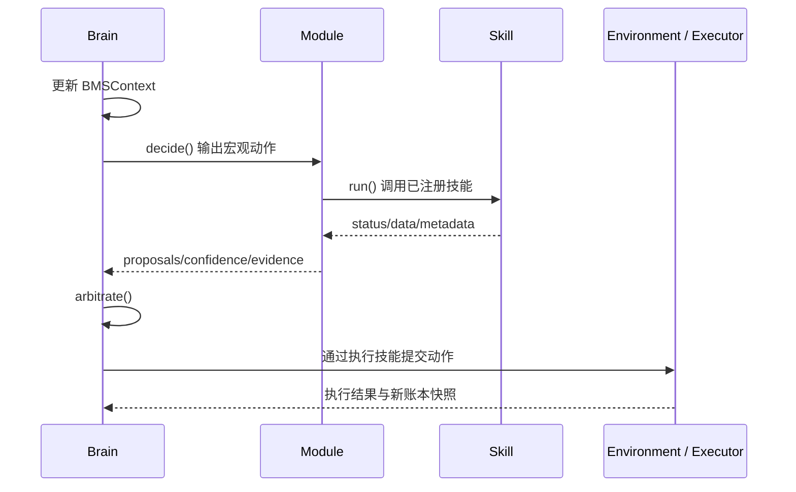

# Brain–Module–Skill 架构

```mermaid
sequenceDiagram
    participant B as Brain
    participant M as Module
    participant S as Skill
    participant E as Environment / Executor
    B->>B: 更新 BMSContext
    B->>M: decide() 输出宏观动作
    M->>S: run() 调用已注册技能
    S-->>M: status/data/metadata
    M-->>B: proposals/confidence/evidence
    B->>B: arbitrate()
    B->>E: 通过执行技能提交动作
    E-->>B: 执行结果与新账本快照
```

硬边界：Skill 不返回 BrainCommand；Module 不暴露账本句柄；资源变更必须由执行技能完成。基础契约位于 `core/bms/base.py`，异常位于 `core/bms/exceptions.py`，注册表位于 `core/bms/registry.py`。
