# Online Service Provisioning in NFV-Enabled Networks Using Deep Reinforcement Learning

> Ali Nouruzi, Abolfazl Zakeri, Mohammad Reza Javan, Nader Mokari, Rasheed Hussain, S. M. Ahsan Kazmi  
> IEEE Transactions on Network and Service Management, 19(3), 3276-3289, 2022  
> DOI: [10.1109/TNSM.2022.3159670](https://doi.org/10.1109/TNSM.2022.3159670)  
> Open version read: [arXiv:2111.02209](https://arxiv.org/abs/2111.02209)  
> Reader status: full-structure draft; equations and algorithms retained, references not translated line by line.

## Page And Section Index

| Pages | Section |
|---|---|
| 1-2 | Abstract, motivation, contributions, related work |
| 3-5 | System model, service and infrastructure model, delay and optimization problem |
| 5-8 | DQN-AR state, action, reward, resource release and routing algorithm |
| 8 | Computational complexity and simulation setup |
| 9-11 | Acceptance ratio, utilization cost, arrival rate, lifetime and topology results |
| 12 | Future work and conclusion |
| 12-13 | References |

## Terminology Ledger

| Canonical term | Chinese | Use in this reader |
|---|---|---|
| Network Function Virtualization (NFV) | 网络功能虚拟化 | First use expanded, then NFV |
| Service Function Chain (SFC) | 服务功能链 | Ordered functions requested by one service |
| Resource Allocation (RA) | 资源分配 | Includes VNF placement and routing |
| DQN-AR | 自适应资源分配深度 Q 网络 | Paper's proposed algorithm |
| Average Acceptance Ratio (AAR) | 平均接受率 | Accepted requests divided by arrivals |
| Average Network Utilization Cost (ANUC) | 平均网络利用成本 | Weighted processing and bandwidth cost |
| tolerable latency | 可容忍时延 | Core/SFC latency constraint, not measured E2E application SLA |

## Abstract

**Source:** p.1 S001

**Original:** The paper studies a DRL-based framework for online end-user service provisioning in an NFV-enabled network. It minimizes network-resource utilization cost while admitting stochastic requests under limited resources and QoS constraints.

**中文:** 论文研究面向 NFV 网络的在线终端服务供给框架。目标是在资源有限并满足 QoS 约束的条件下接纳随机到达的请求，同时最小化网络资源利用成本。

**Source:** p.1 S002

**Original:** The proposed Deep Q-Network for Adaptive Resource allocation (DQN-AR) jointly performs function placement and dynamic routing, using available network resources as DQN states. Service lifetime and request arrivals are modeled probabilistically.

**中文:** 所提出的 DQN-AR 联合完成网络功能放置和动态路由，并把网络剩余资源作为 DQN 状态。服务生命周期和请求到达均采用概率模型。

**Source:** p.1 S003

**Original:** The abstract reports a 7%-14% increase in the average number of admitted requests and a 5%-20% decrease in network utilization cost; the conclusion later states an admission gain up to 20%.

**中文:** 摘要报告平均接纳请求数提高 7%-14%，网络利用成本降低 5%-20%；结论部分则写为接纳请求数最高提高 20%。两处上限表述并不完全一致。

## I. Introduction

**Source:** p.1 S004

**Original:** The motivating problem is how a provider can offer heterogeneous services with probabilistic lifetimes over shared physical resources while handling arrivals and departures online.

**中文:** 核心问题是：服务提供商如何在共享物理资源上，为具有随机生命周期的异构服务进行在线供给，并同时处理请求的到达与离开。

**Source:** pp.1-2 S005

**Original:** A service is admitted only when its SFC and QoS requirements are fulfilled. New requests may arrive while previously accepted services are still running; resources must therefore be allocated on admission and released on departure.

**中文:** 只有 SFC 和 QoS 要求均得到满足时，请求才被接纳。新请求可能在旧请求仍运行时到达，因此系统必须在接纳时分配资源，并在请求离开时释放资源。

**Source:** pp.1-2 S006

**Original:** The claimed contributions are an NFV service-assurance model with bandwidth and latency constraints, a DQN online allocator, probabilistic request lifetime, an available-resource update algorithm, and comparison with NFVdeep, Tabu search and greedy baselines.

**中文:** 论文贡献包括：具有带宽和时延约束的 NFV 服务保障模型、在线 DQN 资源分配器、随机服务生命周期、剩余资源更新算法，以及与 NFVdeep、Tabu 搜索和 Greedy 的比较。

## II. System Model And Formulation

**Source:** p.3 S007

**Original:** Each service request specifies an ingress node, an egress node, an ordered SFC, a data rate, a tolerable SFC latency, and per-function processing demand in CPU cycles per bit.

**中文:** 每条服务请求包含入口节点、出口节点、有序 SFC、数据速率、可容忍 SFC 时延，以及各网络功能的单位比特处理需求。

### Fig. 1. System model

**Placed near:** p.3 S007  
**Source:** p.3 C001

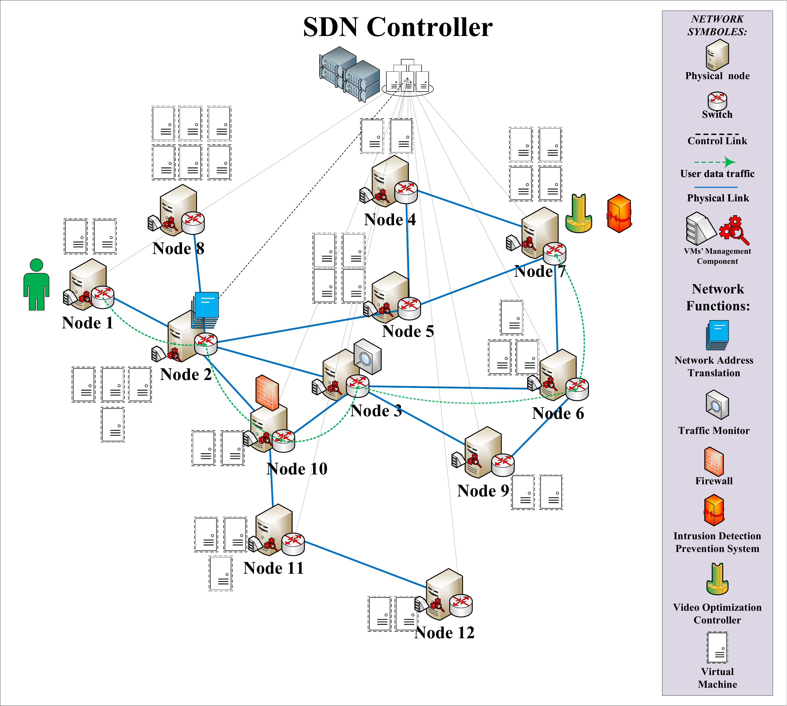

**Original caption:** High level representation of the considered system model.

**中文图注:** 所考虑系统模型的高层表示。

**Reading note:** The SDN controller is the single decision agent. Physical nodes host multiple VMs; blue links are physical links and the green path is one service flow.

**Source:** p.3 S008

**Original:** Functions may be placed on successive or non-successive physical nodes. The order of VNFs in the requested SFC must be preserved.

**中文:** VNF 可以放置在连续或不连续的物理节点上，但必须保持请求规定的 SFC 功能顺序。

### Fig. 2. Two SFC placement patterns

**Placed near:** p.3 S008  
**Source:** p.3 C002

**Original caption:** An example of SFC with different scenarios for function placement: successive nodes or non-successive nodes.

**中文图注:** SFC 功能放置示例：功能可以部署在连续节点，也可以部署在非连续节点。

**Source:** pp.3-4 S009

**Original:** The infrastructure is an undirected connected graph. Every physical node may host several VMs with finite processing capacities, while every link has finite bandwidth and propagation delay. Candidate virtual paths map to physical paths.

**中文:** 基础设施被建模为连通无向图。每个物理节点可承载多个处理能力有限的 VM；每条链路具有有限带宽和传播时延；虚拟路径需要映射到物理路径。

**Source:** pp.4-5 S010

**Original:** Total service delay contains VNF processing delay, propagation delay and transmission delay. The paper explicitly notes that its tolerable latency is SFC/core-network latency rather than complete application end-to-end latency.

**中文:** 服务总时延由 VNF 处理时延、传播时延和传输时延组成。论文明确指出，可容忍时延是 SFC/核心网时延，而不是完整应用端到端时延。

### Fig. 3. Propagation and transmission delay terms

**Placed near:** pp.4-5 S010  
**Source:** p.4 C003

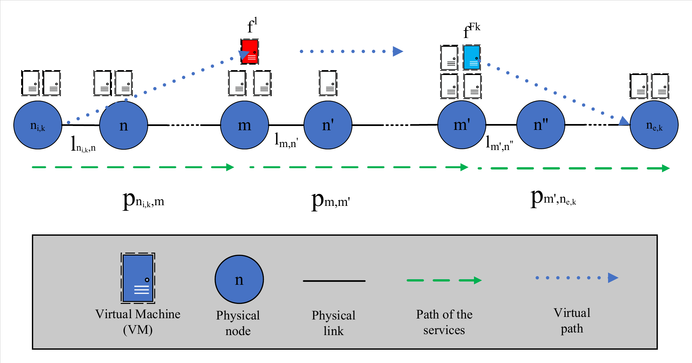

**Original caption:** Illustration of the propagation and transmission delay calculation between ingress, VNF-hosting VMs and egress.

**中文图注:** 入口节点、VNF 所在 VM 与出口节点之间传播和传输时延的计算示意。

**Source:** p.5 S011

**Original:** The objective is a weighted sum of processing-resource cost and link-bandwidth cost. Constraints enforce link capacity, VM processing capacity, exactly one placement per function, SFC order and tolerable latency.

**中文:** 目标函数是处理资源成本与链路带宽成本的加权和。约束包括链路容量、VM 处理容量、每个功能唯一放置、SFC 顺序和可容忍时延。

**Source:** p.5 S012

**Original:** The resulting joint placement and path-selection problem is formulated as an integer linear optimization problem, which motivates an approximate RL solution for online use.

**中文:** 联合 VNF 放置和路径选择被表述为整数线性优化问题。由于在线求解代价高，论文转而采用强化学习近似求解。

## III. Proposed DQN-AR Solution

**Source:** p.5 S013

**Original:** The SDN controller is the RL agent. At each step it observes the environment, selects an action, receives a reward and stores the transition for experience replay.

**中文:** SDN 控制器作为强化学习智能体。每一步观察环境、选择动作、获得奖励，并将转移存入经验回放。

**Source:** pp.5-6 S014

**Original:** DQN uses epsilon-greedy exploration. Epsilon starts at 1, decays by 0.9 and ends at 0.1. Replay memory size is 2000, mini-batch size is 8, learning rate is 0.001 and discount factor is 0.95.

**中文:** DQN 使用 epsilon-greedy 探索。epsilon 从 1 开始，以 0.9 衰减，最终为 0.1；经验池大小为 2000，mini-batch 为 8，学习率为 0.001，折扣因子为 0.95。

**Source:** p.6 S015

**Original:** The network state is `S^t=(Z^t,Y^t)`, where `Z^t` contains available VM processing resources and `Y^t` contains available link bandwidth. Resource use is discretized into `I=1000` normalized levels.

**中文:** 网络状态为 `S^t=(Z^t,Y^t)`：`Z^t` 表示 VM 剩余处理资源，`Y^t` 表示链路剩余带宽。资源利用被归一化并离散为 `I=1000` 个等级。

**Source:** p.6 S016

**Original:** Besides resource matrices, the DQN input includes service specification, ingress, egress, current node, current VM and the current position in the SFC. At most `J=100` node-by-node decisions are allowed per time slot.

**中文:** 除资源矩阵外，DQN 输入还包含服务规格、入口、出口、当前节点、当前 VM 和当前 SFC 功能位置。每个时隙最多允许 `J=100` 次逐节点决策。

**Source:** p.6 S017

**Original:** The available-resource algorithm subtracts processing and bandwidth resources when a service is admitted, records its arrival and lifetime, and restores those resources when the service departs.

**中文:** 剩余资源算法在请求被接纳时扣除处理和带宽资源，记录其到达时刻与生命周期，并在请求离开时归还资源。

**Source:** pp.6-7 S018

**Original:** The action space contains all VM-node choices, each interpreted either as placing the next function or using the node as a forwarding switch. Its nominal size is `|N| x |V_total| x 2`, but only directly reachable feasible choices form the current masked subset.

**中文:** 动作空间包括全部“节点-VM”组合，每个动作还区分“放置下一个功能”或“仅作为转发节点”。名义动作空间大小为 `|N| x |V_total| x 2`，实际每步只允许直接可达且可行的动作子集。

### Fig. 4. Node-by-node routing and function placement

**Placed near:** pp.6-7 S018  
**Source:** p.7 C004

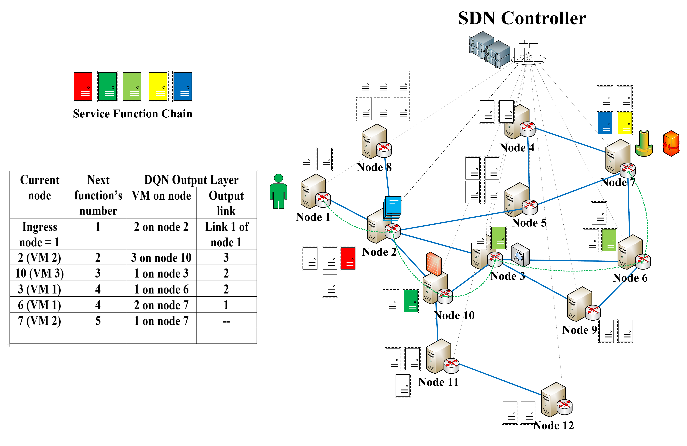

**Original caption:** An example of function placement and node-by-node routing for a specific service.

**中文图注:** 针对某一服务进行逐节点路由和功能放置的示例。

**Source:** p.7 S019

**Original:** For a feasible step, reward is `r = w_acc - w_cost * action_cost`; if capacity or latency constraints fail, the request is rejected and reward is zero. Total request reward is the sum over routing/placement steps.

**中文:** 对可行步骤，奖励为 `r = w_acc - w_cost * 动作成本`；如果容量或时延约束不满足，请求被拒绝且奖励为 0。整条请求的奖励是所有逐步路由/放置奖励之和。

**Source:** p.7 S020

**Original:** Starting at ingress, DQN-AR repeatedly chooses a neighboring VM/node, decides whether to place a function or forward, checks bandwidth, CPU and accumulated latency, and stops at egress after all functions are placed. Failure at any step rejects the whole request.

**中文:** DQN-AR 从入口出发，反复选择相邻节点/VM，决定放置功能还是仅转发，并检查带宽、CPU 和累计时延；全部功能放置并到达出口后成功。任一步失败都会拒绝整条请求。

### Fig. 5. DQN input and output

**Placed near:** p.7 S020  
**Source:** p.7 C005

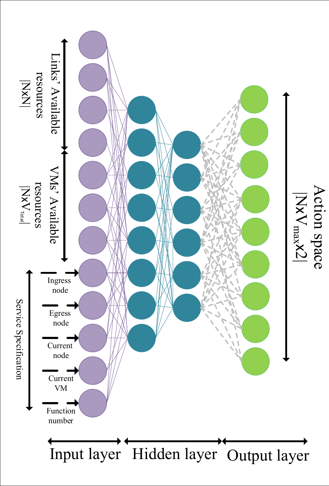

**Original caption:** The DQN determines the action from network state and service specification.

**中文图注:** DQN 根据网络状态和服务规格确定动作。

**Reading note:** The output is a large fixed node/VM/action vector. This is the main reason the method is topology-size dependent.

## IV. Complexity And Experimental Design

**Source:** p.8 S021

**Original:** DQN inference complexity is expressed through input, hidden and output-layer sizes. The paper compares it with NFVdeep, Tabu search and greedy, but does not report real controller setup latency or Mininet/OVS execution latency.

**中文:** 论文用输入层、隐藏层和输出层规模分析 DQN 推理复杂度，并与 NFVdeep、Tabu 和 Greedy 比较，但没有报告真实控制器建链时延或 Mininet/OVS 执行时延。

**Source:** p.8 S022

**Original:** Simulations use 10-100 server nodes, up to 6 VMs per node, link capacity 1600-6400 Mbps, VM capacity 200-1200 CPU cycles/s, link propagation delay 5-15 ms, data rates 64 Kbps-4 Mbps and tolerable latency 100-500 ms.

**中文:** 仿真采用 10-100 个服务器节点、每节点最多 6 个 VM、链路容量 1600-6400 Mbps、VM 容量 200-1200 CPU cycles/s、链路传播时延 5-15 ms、数据率 64 Kbps-4 Mbps、可容忍时延 100-500 ms。

**Source:** p.8 S023

**Original:** One time slot equals one second. Runs contain 1000-6000 slots, 2000 training iterations and 10 Monte Carlo repetitions. Request count is generated by a uniform random process and service lifetime by an exponential process with means 240, 600, 900 or 1200 seconds. Topologies are random connected NetworkX graphs.

**中文:** 一个时隙为 1 秒；实验包含 1000-6000 个时隙、2000 次训练迭代和 10 次蒙特卡洛重复。请求数量由均匀随机过程生成，生命周期服从均值为 240、600、900 或 1200 秒的指数分布。拓扑是 NetworkX 生成的随机连通图。

## V. Results

**Source:** p.9 S024

**Original:** AAR rises with training iterations. Larger networks start with lower and more volatile AAR because more node-by-node actions are needed, but the plotted curves converge near 0.98-1.00 after roughly 800 iterations.

**中文:** AAR 随训练迭代上升。大拓扑由于需要更多逐节点动作，初始接受率较低且波动更大；图中约 800 次迭代后，各规模曲线收敛到约 0.98-1.00。

### Fig. 6. AAR convergence

**Placed near:** p.9 S024  
**Source:** p.9 C006

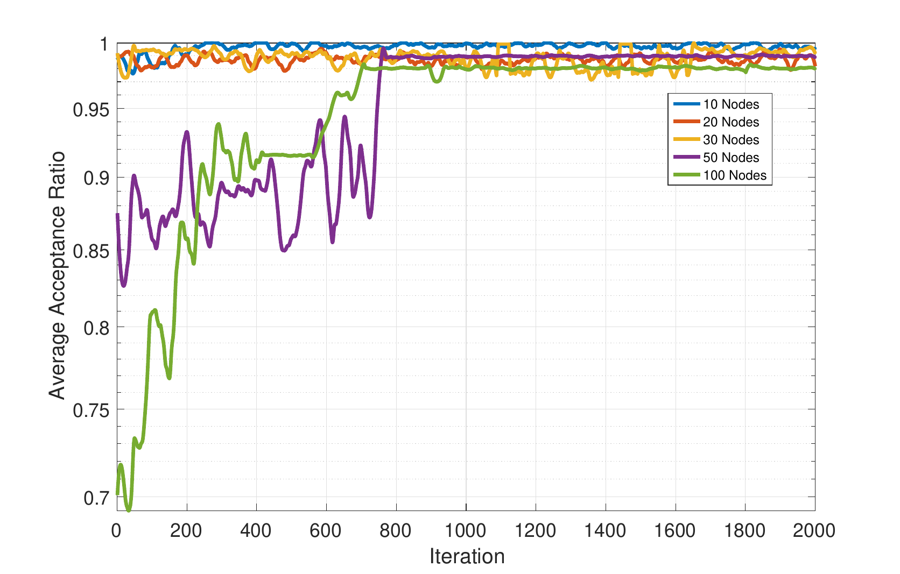

**Original caption:** AAR over iterations for different network topologies.

**中文图注:** 不同网络规模下 AAR 随训练迭代的变化。

**Source:** p.9 S025

**Original:** ANUC is initially high under random exploration and falls as the agent learns lower-cost paths and placements. Larger networks generally incur greater cost because paths are longer.

**中文:** 随机探索阶段的 ANUC 较高；随着智能体学会低成本路径和放置方案，成本逐步下降。由于路径更长，大规模网络通常具有更高成本。

### Fig. 7. ANUC convergence

**Placed near:** p.9 S025  
**Source:** p.9 C007

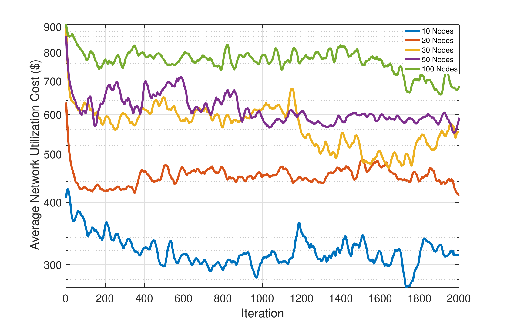

**Original caption:** ANUC over iterations for different network topologies.

**中文图注:** 不同网络规模下 ANUC 随训练迭代的变化。

**Source:** pp.9-10 S026

**Original:** When arrival intensity increases from 5 to 25 requests per second, network utilization cost increases. DQN-AR reports lower cost than NFVdeep, Tabu and greedy because it adapts placement and routing to the current resource state.

**中文:** 当到达强度从每秒 5 条增加到每秒 25 条时，网络利用成本上升。论文称 DQN-AR 根据当前资源状态联合调整放置和路由，因此成本低于 NFVdeep、Tabu 和 Greedy。

### Fig. 8. Arrival rate and utilization cost

**Placed near:** pp.9-10 S026  
**Source:** p.10 C008

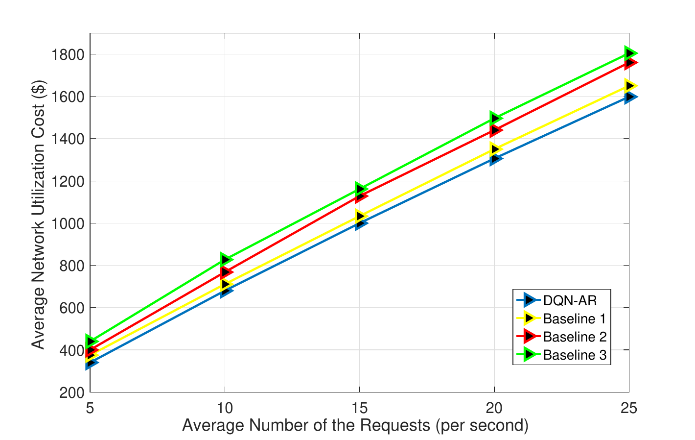

**Original caption:** Average network utilization cost versus average requests per second.

**中文图注:** 平均网络利用成本随每秒平均请求数的变化。

**Source:** p.10 S027

**Original:** Increasing `w_cost` gives more priority to resource cost, lowering both ANUC and AAR. The paper reports that one tested setting reduces AAR by about 12% while reducing ANUC by about 20%.

**中文:** 增大 `w_cost` 会提高资源成本在奖励中的优先级，从而同时降低 ANUC 和 AAR。论文报告某一设置下 AAR 下降约 12%，ANUC 下降约 20%。

### Fig. 9. Cost weight versus AAR

**Placed near:** p.10 S027  
**Source:** p.10 C009

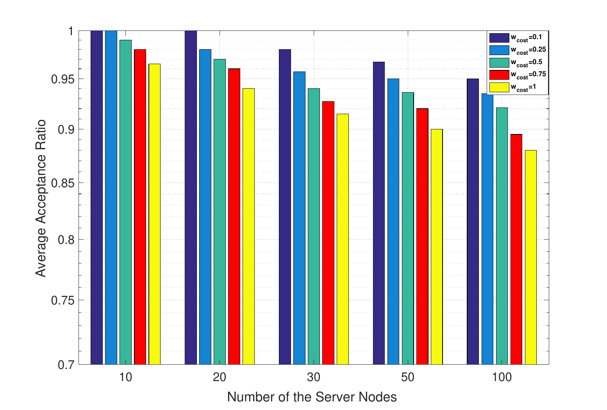

**Original caption:** Comparing AAR under different reward cost coefficients.

**中文图注:** 不同奖励成本系数下的 AAR 比较。

### Fig. 10. Acceptance-cost trade-off across algorithms

**Placed near:** p.10 S027  
**Source:** p.10 C010

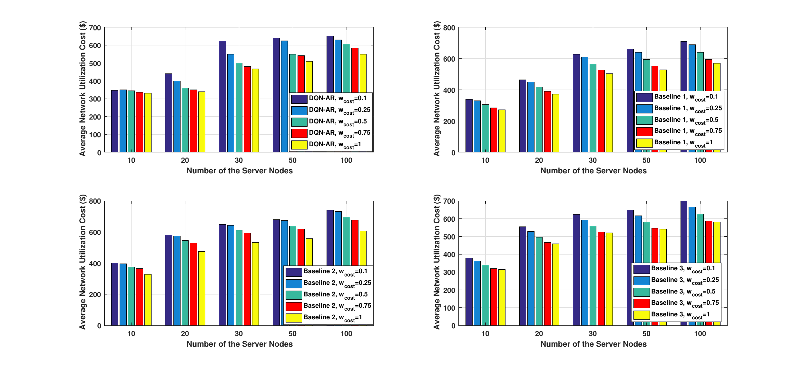

**Original caption:** Performance of DQN-AR and baselines under different `w_cost` values.

**中文图注:** 不同 `w_cost` 下 DQN-AR 与基线算法的资源成本表现。

**Source:** pp.10-11 S028

**Original:** Longer service lifetime reduces available resources and therefore lowers AAR more strongly than request-count changes. Under an exponential lifetime, the survival probability decays over time; resource release is central to the online model.

**中文:** 更长的服务生命周期会持续占用资源，因此对 AAR 的负面影响比请求数变化更明显。指数生命周期使在线用户存活概率随时间下降，资源释放机制是该在线模型的核心。

### Fig. 11. Service survival probability

**Placed near:** pp.10-11 S028  
**Source:** p.10 C011

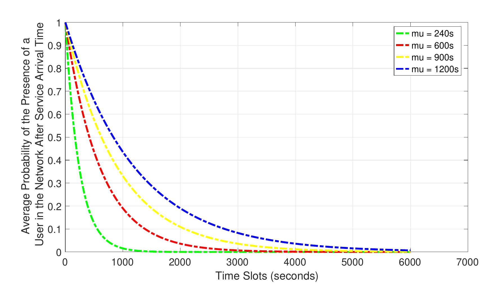

**Original caption:** Probability that a user remains in the network after service arrival.

**中文图注:** 用户在服务到达后仍留在网络中的概率。

### Fig. 12. Lifetime versus AAR

**Placed near:** pp.10-11 S028  
**Source:** p.11 C012

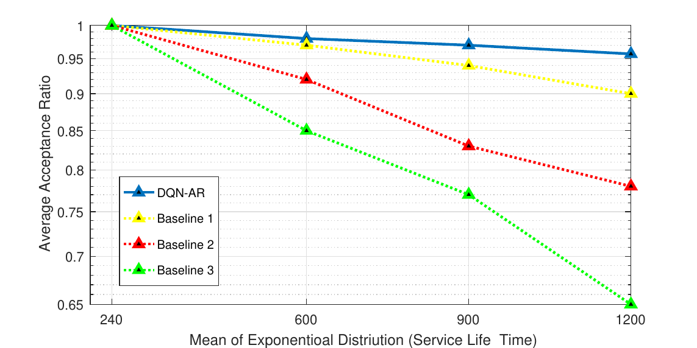

**Original caption:** Effect of service lifetime on AAR.

**中文图注:** 服务生命周期对 AAR 的影响。

**Source:** p.11 S029

**Original:** Increasing server nodes and links increases available capacity and AAR, while larger and more scattered topologies increase ANUC through longer paths. DQN-AR claims an advantage because it jointly chooses placement and routing.

**中文:** 增加服务器节点和链路会增加可用容量并提高 AAR；但更大、更分散的拓扑会因路径变长而提高 ANUC。论文将 DQN-AR 的优势归因于联合放置和路由决策。

### Fig. 13. Network resources versus AAR

**Placed near:** p.11 S029  
**Source:** p.11 C013

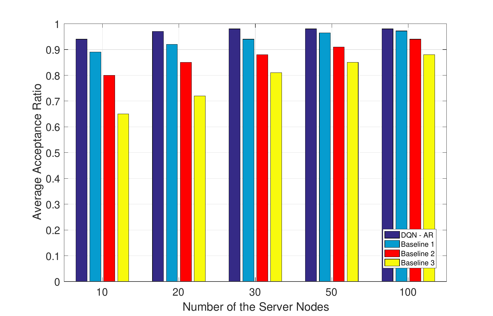

**Original caption:** Effect of network resources on AAR.

**中文图注:** 网络资源规模对 AAR 的影响。

### Fig. 14. Topology size versus ANUC

**Placed near:** p.11 S029  
**Source:** p.11 C014

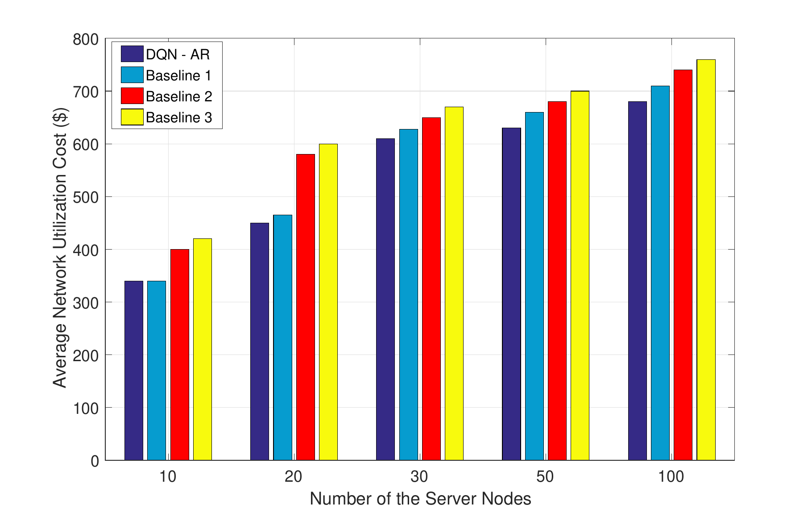

**Original caption:** Effect of network size and server-node count on ANUC.

**中文图注:** 网络规模和服务器节点数对 ANUC 的影响。

## VI-VII. Future Work And Conclusion

**Source:** p.12 S030

**Original:** Future work proposes recurrent or deterministic policy-gradient methods for proactive and predictive allocation. The paper does not implement multi-agent RL, graph neural networks, multicast trees or a real SDN testbed.

**中文:** 未来工作提出使用循环模型或确定性策略梯度进行主动和预测式分配。论文没有实现多智能体强化学习、图神经网络、组播树或真实 SDN 测试床。

**Source:** p.12 S031

**Original:** The conclusion attributes higher service acceptance and lower utilization cost to a piecewise reward that balances constraint satisfaction and action cost, together with DQN-based online routing and placement.

**中文:** 结论认为，通过分段奖励平衡约束满足与动作成本，并使用 DQN 在线联合路由和放置，可以提高服务接受率并降低资源利用成本。

## Critical Reading Notes For This Project

1. **This is not an SLA measured on Mininet.** Its QoS is an analytical bandwidth/CPU/SFC-latency feasibility model. It does not measure UDP loss, jitter, startup deadline or OpenFlow installation delay.
2. **Its action is incremental.** DQN-AR selects the next neighboring node/VM at every routing step. Your current WQMIX selects one complete candidate plan per request, which is much faster online and avoids up to `J=100` neural decisions.
3. **Its agent is centralized.** The SDN controller is one DQN agent; it is not MARL. Your request-as-agent micro-batch formulation is a substantive extension.
4. **Its online lifecycle model directly supports your design.** Allocation on admission and exact release on departure closely match `AtomicResourceLedger` and `BatchDeploymentEnv`.
5. **Its experimental load is relevant.** It tests 5-25 requests/s and 10-100 nodes, close to your 24 requests/s and planned 100-node topology. However, its lifetimes are 240-1200 s, far longer than your current roughly 1-6 s trace.
6. **Its reported near-1.0 AAR is simulation feasibility, not strict data-plane SLA.** It should not be compared directly with your 39% Mininet strict-SLA result.
7. **A strong thesis comparison is available.** Reimplement or approximate DQN-AR as a single-agent incremental baseline, then compare it with Greedy, BC and WQMIX under the same candidate set and the same Mininet execution layer.

## References

The full 49-entry reference list is preserved in `source.pdf` and `source_tex/NFVAI.bbl`. It is not translated line by line in this draft reader.
